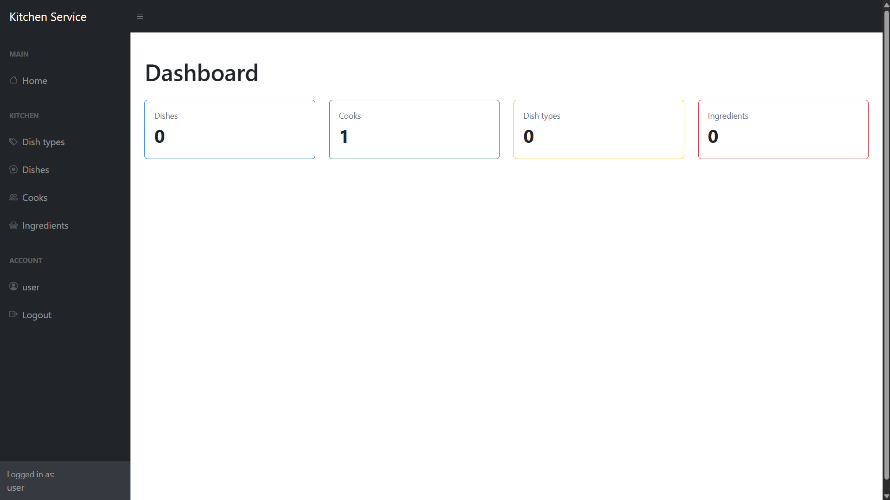
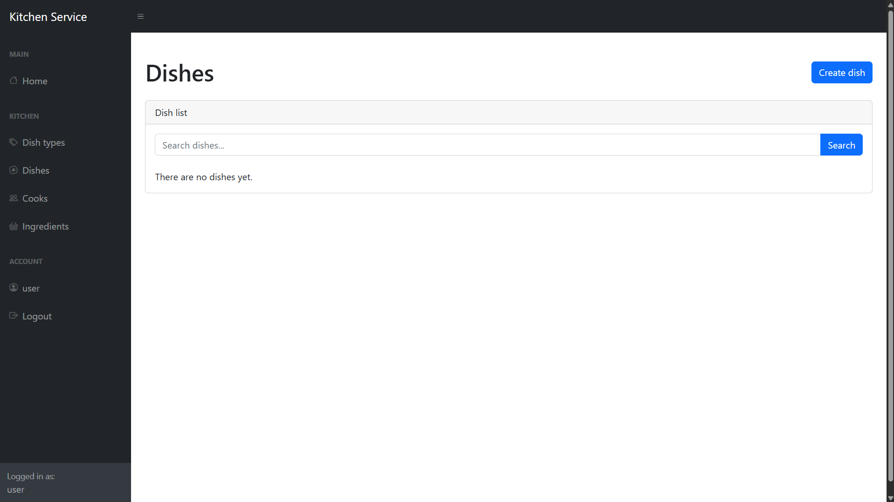
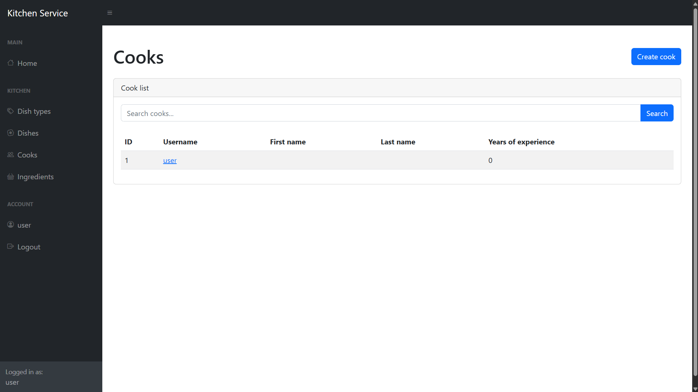
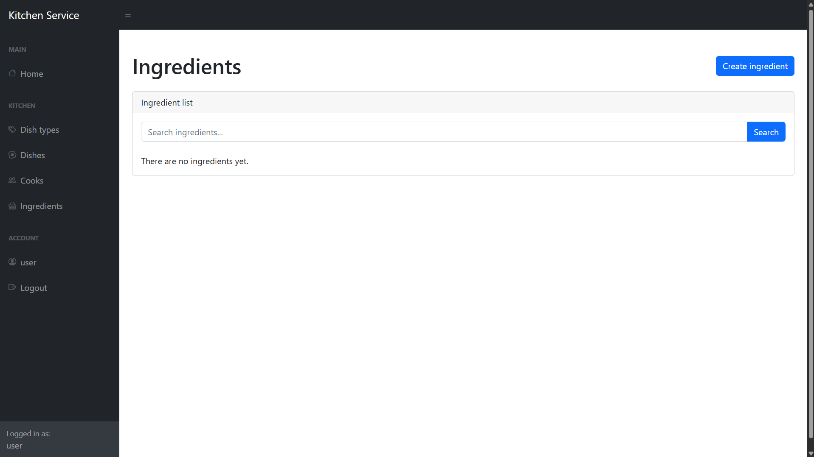

# Restaurant Kitchen Service

Restaurant Kitchen Service is a Django web application for managing a restaurant kitchen.

The application allows users to manage cooks, dishes, dish types, and ingredients. It includes authentication, CRUD functionality, search, pagination, and a responsive admin-style interface.

## Features

- User authentication
- Custom `Cook` user model
- Cook management
- Dish management
- Dish type management
- Ingredient management
- Assign multiple cooks to dishes
- Assign multiple ingredients to dishes
- Search functionality
- Pagination
- Django admin panel
- Responsive interface based on SB Admin / Bootstrap
- Automated tests

## Technologies

- Python
- Django
- SQLite
- HTML
- CSS
- Bootstrap
- SB Admin

## Database Structure


Main entities:

- `Cook`
- `Dish`
- `DishType`
- `Ingredient`

Relationships:

- A dish belongs to one dish type
- A dish can have multiple cooks
- A cook can prepare multiple dishes
- A dish can have multiple ingredients
- An ingredient can be used in multiple dishes

## Installation

### 1. Clone the repository

```bash
git clone https://github.com/Arenkton/restaurant-kitchen-service.git
cd restaurant-kitchen-service
```

### 2. Create a virtual environment

```bash
python -m venv .venv
```

Activate it on Windows:

```bash
.venv\Scripts\activate
```

On macOS/Linux:

```bash
source .venv/bin/activate
```

### 3. Install dependencies

```bash
pip install -r requirements.txt
```

### 4. Configure environment variables

Copy `.env.sample` to `.env`.

Example:

```env
DJANGO_SECRET_KEY=your-secret-key-here
DJANGO_DEBUG=True
```

You can generate a Django secret key with:

```bash
python -c "from django.core.management.utils import get_random_secret_key; print(get_random_secret_key())"
```

### 5. Apply migrations

```bash
python manage.py migrate
```

### 6. Create a superuser

```bash
python manage.py createsuperuser
```

### 7. Run the development server

```bash
python manage.py runserver
```

Open:

```text
http://127.0.0.1:8000/
```

## Running Tests

Run all tests with:

```bash
python manage.py test
```

The project includes tests for:

- models
- model relationships
- forms
- authentication-required views
- list and detail views
- search functionality

## Demo

Live website: https://restaurant-kitchen-service-5yn0.onrender.com

Test user:
```text
Username: user
Password: user12345
```

## Screenshots

### Dashboard



### Dishes



### Cooks



### Ingredients



## Author

Developed by Artem Yur.
